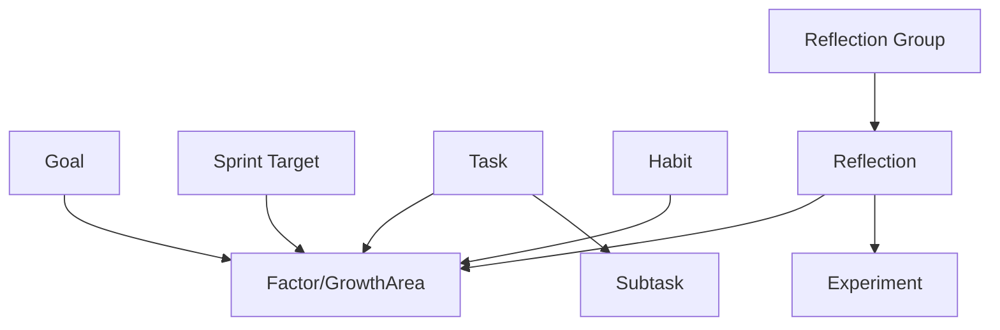

# Backend Architecture Documentation

This document provides a comprehensive technical overview of the application's backend architecture. Since this is a local-first Flutter application, the "backend" refers to the local persistence layer, state management logic, and service infrastructure that powers the app.

## 1. Architecture Overview

The application follows a **Local-First, Offline-Capable** architecture. It relies on a high-performance NoSQL database (Hive) for data persistence and uses the Provider pattern for state management.

### **Core Stack**
*   **Database**: [Hive](https://pub.dev/packages/hive) (NoSQL, key-value object store).
*   **State Management**: [Provider](https://pub.dev/packages/provider) (`ChangeNotifier`).
*   **Dependency Injection**: Implicit via `Provider` hierarchy.
*   **Serialization**: `hive_generator` for binary serialization, `json_serializable` logic (manual) for backups.

### **Design Pattern**
The app implements a variation of the **Repository + Service** pattern:
1.  **Storage Layer (`StorageService`)**: Acts as the Repository. Direct access to Hive boxes. Handles raw CRUD operations.
2.  **State Layer (`AppState`)**: Acts as the Logical Service + ViewModel. Holds in-memory data cache, handles business logic (gamification, XP, validation), and manages the optimistic UI state.
3.  **UI Layer**: Consumes `AppState` via `Consumer<AppState>` or `context.watch<AppState>()`.

---

## 2. Data Persistence (Hive)

Hive is used for fast, synchronous read access and asynchronous write operations. Data is stored in "Boxes" (analogous to SQL tables or MongoDB collections).

### **Initialization**
The database is initialized in `main.dart` via `StorageService.initialize()`. This process:
1.  Initializes Hive for Flutter.
2.  Registers all TypeAdapters (mapping Dart objects to binary).
3.  Opens all necessary Boxes to ensure synchronous access later.

### **Hive Boxes**
| Box Name | Content Description |
| :--- | :--- |
| `goals` | Long-term user Goals. |
| `factors` | "Growth Factors" (formerly Growth Areas) linked to Goals. |
| `tasks` | Actionable items (Priority, Backlog). |
| `subtasks` | Granular steps for tasks. |
| `habits` | Daily/Regular habits to build or quit. |
| `sprintTargets` | Short-term targets (Weekly/Monthly) linked to Factors. |
| `reflections` | User reflection entries (journaling). |
| `reflectionGroups` | Logic grouping for reflection cycles (e.g., Kolb's Cycle). |
| `experiments` | Behavioral experiments linked to reflections. |
| `barriers` | Logged obstacles/barriers encountered. |
| `userStats` | Gamification data (XP, Level, Coins, Streaks). |
| `achievements` | Unlocked achievements. |
| `focusLogs` | Pomodoro/Focus session history. |
| `settings` | App-wide configuration (Time Availability, Onboarding). |

### **Type Adapters**
Custom objects (e.g., `Task`, `Habit`) are annotated with `@HiveType` and `@HiveField`.
*   Code generation (`flutter pub run build_runner build`) creates the `.g.dart` files containing the binary serialization logic.
*   **Important**: Adapter IDs (e.g., `@HiveType(typeId: 1)`) must remain unique and constant to prevent data corruption.

---

## 3. State Management (`AppState`)

`AppState` is the central "God Object" provider that manages the entire application state. While typically monolithic, this approach simplifies cross-feature dependencies (e.g., completing a Task updates User Stats AND Factor Health).

### **Optimistic UI Pattern**
The app heavily uses Optimistic UI updates to ensure the interface feels instant.

**The Flow:**
1.  **UI Action**: User clicks "Complete Task".
2.  **Local Update**: `AppState` immediately updates the in-memory `_tasks` list and calls `notifyListeners()`.
3.  **UI Rebuild**: The UI reflects the change instantly (0ms latency).
4.  **Background Persistence**: `StorageService.saveTask()` is called asynchronously.
    *   *Success*: Silent completion.
    *   *Failure*: Error logged (and potentially state reverted/retried, though simple fire-and-forget is currently used for minor actions).

### **Logic Features**
*   **Gamification**: XP and Coin logic is embedded in `AppState`. Actions like completing tasks call `_userStats.earnReward()`.
*   **Feedback Loops**: Completing items (Tasks/Habits) triggers updates to their linked `Factor` (Health increases).

---

## 4. Services

### **`StorageService` (lib/services/storage_service.dart)**
*   **Role**: The low-level database accessor.
*   **Key Methods**:
    *   `initialize()`: Bootstraps Hive.
    *   `getAllX()`: Returns list of all items in a box.
    *   `saveX(item)`: Puts an item into its box (Upsert).
    *   `deleteX(id)`: Removes an item.
*   **Safety**: Uses `_ensureBoxOpen` to handle potentially closed boxes (defensive programming).

### **`BackupService` (lib/services/backup_service.dart)**
*   **Role**: Handles Import/Export of all user data.
*   **Format**: JSON.
*   **Versioning**: Includes `metadata` with version info to handle schema migrations in the future.
*   **Functionality**:
    *   `exportAllData()`: Aggregates all Hive data into a massive JSON object and saves to Downloads/Documents.
    *   `importData()`: Parcels a JSON file, validates structure, clears existing data (if `replace` mode), and bulk-inserts into Hive.

### **Other Services**
*   `NotificationService`: Wrapper around `flutter_local_notifications` for reminders.
*   `HapticService`: Provides tactile feedback for interactions.

---

## 5. Data Models

Data models are located in `lib/models/`. They define the schema and business rules for entities.

### **Key Relationships**

*   **Factor (GrowthArea)**: The central hub. Nearly all actionable items (Tasks, Habits, Sprints) link back to a Factor to contribute to its "Health".

---

## 6. Critical Workflows

### **App Startup**
1.  `main.dart`: Calls `StorageService.initialize()`.
2.  `MultiProvider`: Initializes `AppState`.
3.  `MyApp`: `AppState.loadData()` is triggered (often in `initState` or lazily).
4.  `loadData()`: Fetches all `values` from Hive boxes into `AppState` memory lists.
5.  `isLoading` set to false -> UI renders.

### **Sync/Backup**
*   There is **NO** real-time cloud sync.
*   Data portability relies entirely on `BackupService` generating JSON files.
*   Cross-device sync is manual (Export on Phone A -> Transfer File -> Import on Tablet B).

## 7. Troubleshooting & Maintenance

*   **Corrupted Data**: `StorageService.clearAllData()` allows a factory reset of the database.
*   **Schema Changes**: When adding fields to models:
    1.  Add internal field.
    2.  Add `@HiveField(index)` with a NEW index.
    3.  Run `flutter pub run build_runner build`.
    4.  *Never* change the index of existing fields.

