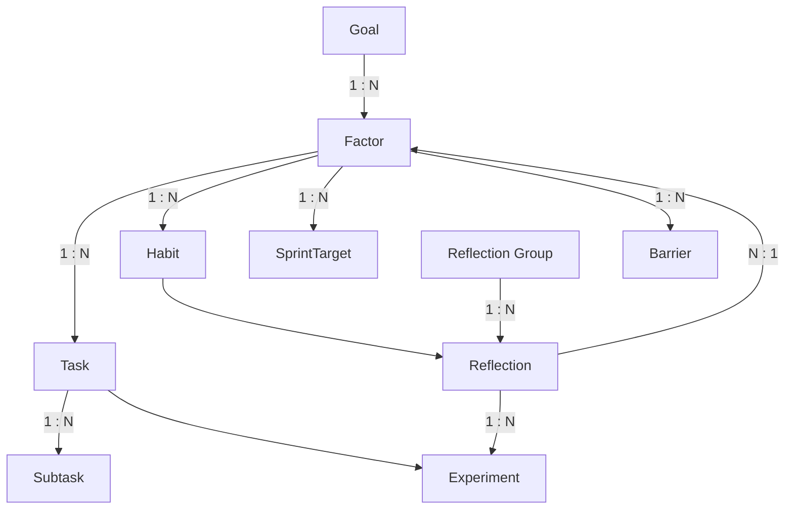

# Database Relationships & Schema Documentation

This document details the data structure and relationships between the various entities in the local Hive database. It explains how different data points are connected to form the cohesive "Goal Achievement Framework".

## 1. Entity-Relationship Overview

The database Schema is a **Star-like Schema** centered around the **Factor** (Growth Area) entity. Almost all actionable or reflective items connect back to a Factor.

### **Diagram**

---

## 2. Core Entities & Connections

### **1. Goal (The Anchor)**
*   **Role**: Top-level long-term objective (6-12 months).
*   **Links**:
    *   **to Factors (`factorIds`)**: A Goal is dissected into multiple Factors (Knowledge, Skills, Attributes). This is a **1-to-many** relationship (One Goal -> Many Factors).

### **2. Factor (The Hub)**
*   **Role**: The central node for "Work". Represents a specific area of growth (e.g., "Fluency in Dart", "Networking Skills").
*   **Incoming Links**:
    *   **from Goal**: Parent Goal.
*   **Outgoing Links**:
    *   **to Habits (`linkedHabitIds`)**: List of habits that contribute to this factor.
*   **Implicit Links (via other objects)**:
    *   **Tasks**: Tasks link *to* a Factor via `linkedFactorIds`.
    *   **Reflections**: Reflections tag a Factor via `linkedFactorIds` or `targetFactorId`.

### **3. Task (Actionable)**
*   **Role**: Single unit of work.
*   **Links**:
    *   **to Factors (`linkedFactorIds`)**: A Task contributes to the "Health" of one or more Factors. When completed, the linked Factors earn health points.
    *   **to Subtasks**: Parent-child relationship (implied by `Subtask.parentTaskId`).
    *   **to Experiment (`experimentId`)**: Optional link if the task was generated from a reflection experiment.
    *   **Blocked By (`blockedByTaskId`)**: Dependency link to another task.

### **4. Habit (Recurring Action)**
*   **Role**: Repeated behaviors.
*   **Links**:
    *   **to Factor (`factorId`)**: Links to a single Factor.
    *   **to Logs**: Internal list of `HabitLog` objects tracking daily completion.

### **5. Reflection (Kolb's Cycle)**
*   **Role**: Journaling and learning entries.
*   **Links**:
    *   **to Factor (`targetFactorId`, `linkedFactorIds`)**: Identifies which area of life/growth is being reflected upon.
    *   **to Experiments (`experimentIds`)**: Extracts actionable experiments from the reflection.
    *   **to Group (`groupId`)**: Links to a `ReflectionGroup` to form a chain/cycle of reflections.
    *   **to Previous Reflection (`previousReflectionId`)**: Threading for follow-up reflections (linked list style).

### **6. Experiment (Behavioral Hypothesis)**
*   **Role**: A testable action derived from reflection.
*   **Links**:
    *   **to Reflection (`reflectionId`)**: Which reflection spawned this experiment.
    *   **to Task**: (Implicit) Can be converted into a Task.

---

## 3. Data Flow and Logic Connections

### **The "Health" Feedback Loop**
The most critical logical connection is the **Factor Health System**:
1.  **Work is Done**: A `Task` is completed or a `Habit` is logged.
2.  **Lookup**: The app looks up the `linkedFactorIds` (Task) or `factorId` (Habit).
3.  **Update**: The corresponding `Factor` entity is retrieved.
    *   `lastWorkedOn` is updated to `DateTime.now()`.
    *   `healthPercent` is increased (capped at 100%).
4.  **Decay**: If no work is done for days, the `Factor` health silently decays based on `lastWorkedOn`.

### **The "Reflection" Cycle**
Reflections are not just isolated entries; they form chains:
1.  **ReflectionGroup**: Acts as a container.
2.  **Chain**: Reflection A (`previous: null`) -> Reflection B (`previous: A.id`) -> Reflection C (`previous: B.id`).
3.  **Closure**: The cycle often ends with an `Experiment` which then feeds back into a new `Task` or `Habit`.

---

## 4. Foreign Key Reference

While NoSQL doesn't strictly enforce foreign keys, here is the reference map used in the code:

| Entity | Field | Target Entity | Note |
| :--- | :--- | :--- | :--- |
| `Factor` | `goalId` | `Goal` | Parent Goal |
| `Task` | `linkedFactorIds` | `Factor` | Many-to-Many logic |
| `Task` | `blockedByTaskId` | `Task` | Self-reference |
| `Subtask` | `parentTaskId` | `Task` | Parent Task |
| `Habit` | `factorId` | `Factor` | Primary Factor |
| `SprintTarget` | `linkedFactorIds` | `Factor` | Focus Area |
| `Reflection` | `targetFactorId` | `Factor` | Primary Topic |
| `Reflection` | `groupId` | `ReflectionGroup` | Group Container |
| `Reflection` | `previousReflectionId`| `Reflection` | Linked List (Prev) |
| `Experiment` | `reflectionId` | `Reflection` | Origin |
| `Barrier` | `factorId` | `Factor` | Context |

## 5. Storage Implementation Details

*   **IDs**: All IDs are UUID v4 strings generated via `uuid` package.
*   **Lists**: relationships are stored as `List<String>` (lists of IDs) rather than embedded objects to prevent duplication and sync issues.
*   **Resolution**: The `AppState` or `StorageService` is responsible for "hydrating" these IDs into full objects when needed (e.g., `getFactorsForGoal(goalId)`).

